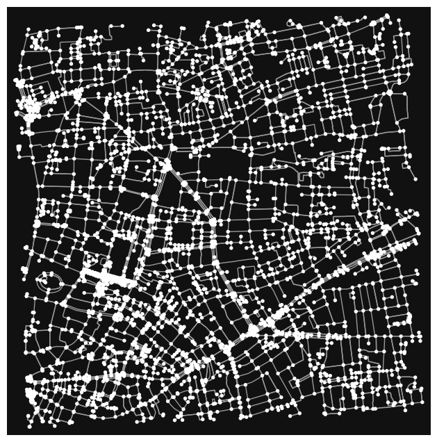
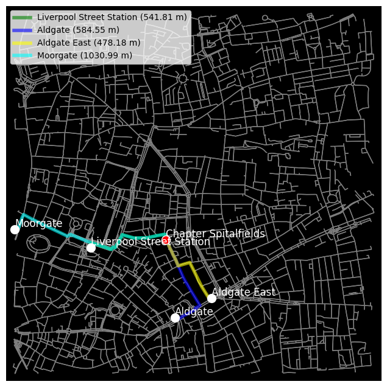
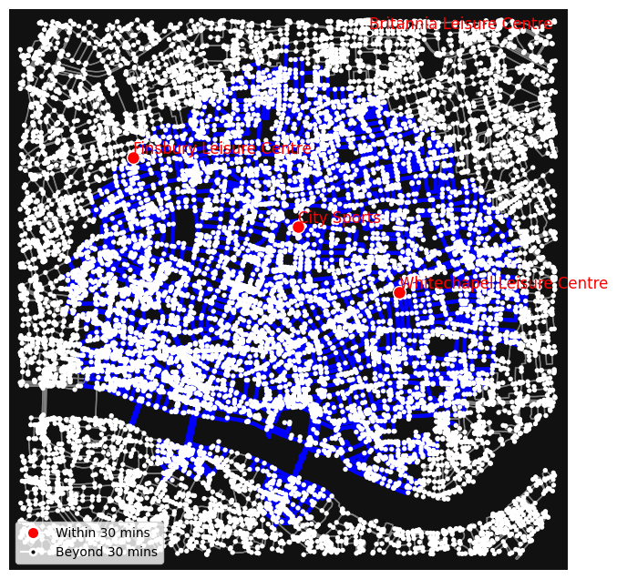
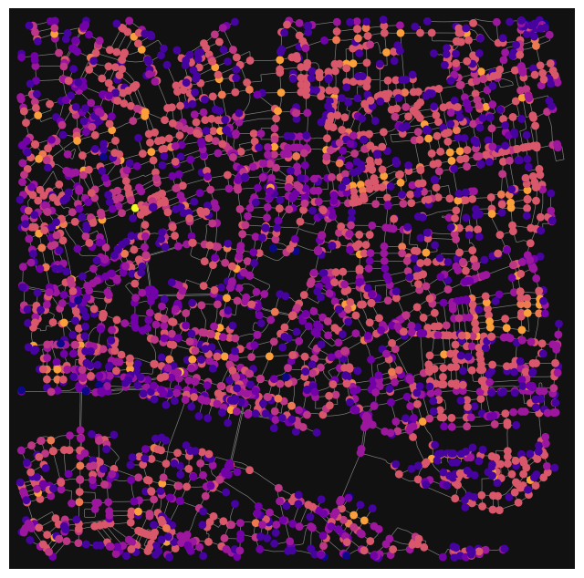
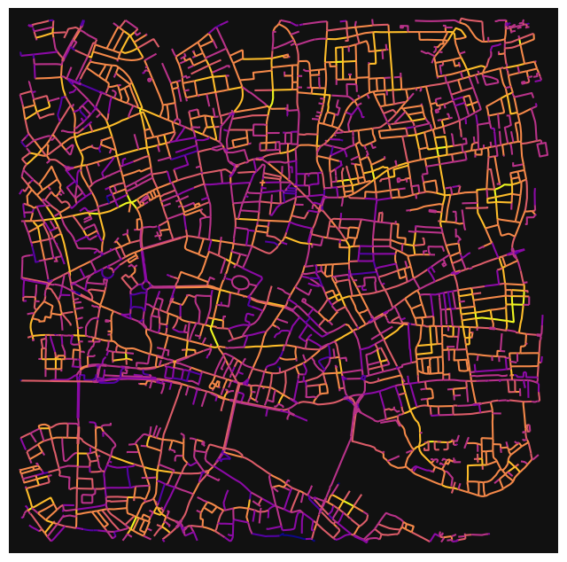
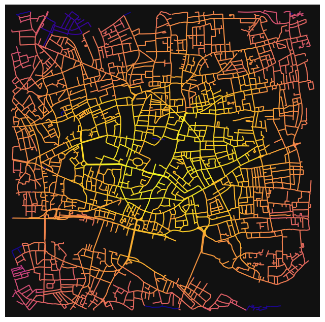

```python
import osmnx as ox
import networkx as nx
import matplotlib.pyplot as plt
import matplotlib.lines as mlines
import pandas as pd
```


```python
#Set geographic data acquisition parameters
# location_name = "Whitechapel, London, UK"

radius = 2000  # 2000m radius
# Set latitude and longitude coordinates
latitude =  51.5203 # Spitalfields
longitude = -0.0740

# Get street network data using latitude and longitude coordinates
graph = ox.graph_from_point((latitude, longitude), dist=1000, network_type='all')

# Draw geographic data
ox.plot_graph(ox.project_graph(graph))
plt.show()

```


    

    


```python
#Set geographic data acquisition parameters
latitude = 51.5203 # Latitude of Spitalfields
longitude = -0.0740 # longitude of Spitalfields
radius = 1000 # Radius of 1000 meters

# Get street network data using latitude and longitude coordinates
graph = ox.graph_from_point((latitude, longitude), dist=radius, network_type='walk')

# Approximate location of metro station and apartment

locations = {
    'Chapter Spitalfields': (51.517842320598405, -0.076822759558025),
    'Liverpool Street Station': (51.5175, -0.0823),
    'Aldgate': (51.5143, -0.0755),
    'Aldgate East': (51.5154, -0.0726),
    'Moorgate': (51.518596727731236, -0.08890437305161719),
}

graph_proj = ox.project_graph(graph)

location_nodes = {}

# Use ox.nearest_nodes to get the nearest nodes for each location
for location, (lat, lon) in locations.items():
    node = ox.nearest_nodes(graph, lon, lat)
    location_nodes[location] = node

# draw map
fig, ax = ox.plot_graph(graph, bgcolor='k', edge_color='gray', node_size=0, show=False, close=False)

# color list
colors = ['red', 'green', 'blue', 'yellow', 'cyan']

# # Calculate each path and add them to the path list
# for i, (location, target_node) in enumerate(location_nodes.items()):
# if location == 'Chapter Spitalfields':
# continue # Skip the apartment itself
# path = nx.shortest_path(graph, source=location_nodes['Chapter Spitalfields'], target=target_node, weight='length')
# paths.append((path, colors[i % len(colors)])) # Add paths and colors to the list as tuples

# # Draw all paths at once
# for path, color in paths:
# ox.plot_graph_route(graph, path, route_color=color, ax=ax, route_linewidth=6, route_alpha=0.9, orig_dest_node_size=0)

# It seems that the plot_graph_route method can only draw one path...

paths = []
# Use matplotlib to draw directly to draw each path
for i, (location, target_node) in enumerate(location_nodes.items()):
     if location == 'Chapter Spitalfields':
         continue # Skip the apartment itself
     path = nx.shortest_path(graph, source=location_nodes['Chapter Spitalfields'], target=target_node, weight='length')
     length = nx.shortest_path_length(graph, source=location_nodes['Chapter Spitalfields'], target=target_node, weight='length')
     long_path = [(graph.nodes[node]['x'], graph.nodes[node]['y']) for node in path]
     xs, ys = zip(*long_path) # Create a set of X and Y coordinates
     ax.plot(xs, ys, color=colors[i % len(colors)], linewidth=4, alpha=0.6, label=f"{location} ({length:.2f} m)") # Add label parameter
     paths.append((path, colors[i % len(colors)]))
    
# Add location markers
for location, (lat, lon) in locations.items():
    if location == 'Chapter Spitalfields':
        node = ox.nearest_nodes(graph, lon, lat)
        x, y = graph.nodes[node]['x'], graph.nodes[node]['y']
        ax.scatter(x, y, c='red', s=100, edgecolor='w', zorder=3)
        ax.text(x, y, location, fontsize=12, color='white', verticalalignment='bottom')
        continue
    node = ox.nearest_nodes(graph, lon, lat)
    x, y = graph.nodes[node]['x'], graph.nodes[node]['y']
    ax.scatter(x, y, c='white', s=100, edgecolor='w', zorder=3)
    ax.text(x, y, location, fontsize=12, color='white', verticalalignment='bottom')
    
# show map
ax.legend(loc='upper left')
plt.show()
```


    

    


```python
import folium
import geopandas as gpd
from shapely.geometry import Point, LineString

# Convert the graph to GeoDataFrames
gdf_nodes, gdf_edges = ox.graph_to_gdfs(graph)

# Create base map
base_map = folium.Map(location=[latitude, longitude], zoom_start=15, tiles='cartodbpositron')

# Draw the path onto the map
for path, color in paths:
    # Get the coordinates of nodes on the path
    line_geom = LineString([(gdf_nodes.loc[node].geometry.x, gdf_nodes.loc[node].geometry.y) for node in path])
    # Create GeoSeries of LineString
    gdf_line = gpd.GeoSeries([line_geom], crs='EPSG:4326')
    # Add to folium map
    folium.GeoJson(gdf_line, style_function=lambda x, color=color: {'color': color, 'weight': 4}).add_to(base_map)

# Draw nodes onto the map
for location, (lat, lon) in locations.items():
    folium.CircleMarker(
        location=(lat, lon),
        radius=5,
        color='black',
        fill=True,
        fill_color='white',
        fill_opacity=1,
        popup=location
    ).add_to(base_map)

# show map
base_map
## shortest distance analysis
# In fact, on Google Maps, Liverpool Street Station is the best in terms of arrival time and distance, which is somewhat different from the analysis results.
# This takes into account the bias caused by obtaining the nearest node. 
# Secondly, Aldgate East and Liverpool Street Station both have multiple different entrances and are not close to each other. 
# This may also be the reason for the bias in the analysis results.

# At the same time, only considering the road network analysis is far from reality. 
# In fact, Liverpool Street Station is located on a busy street and has many subways passing by. 
# Therefore, even if Aldgate East is the closest, Liverpool Street Station is actually the best choice for travel.
```


<div style="width:100%;"><div style="position:relative;width:100%;height:0;padding-bottom:60%;"><span style="color:#565656">Make this Notebook Trusted to load map: File -> Trust Notebook</span><iframe srcdoc="&lt;!DOCTYPE html&gt;
&lt;html&gt;
&lt;head&gt;

    &lt;meta http-equiv=&quot;content-type&quot; content=&quot;text/html; charset=UTF-8&quot; /&gt;

        &lt;script&gt;
            L_NO_TOUCH = false;
            L_DISABLE_3D = false;
        &lt;/script&gt;

    &lt;style&gt;html, body {width: 100%;height: 100%;margin: 0;padding: 0;}&lt;/style&gt;
    &lt;style&gt;#map {position:absolute;top:0;bottom:0;right:0;left:0;}&lt;/style&gt;
    &lt;script src=&quot;https://cdn.jsdelivr.net/npm/leaflet@1.9.3/dist/leaflet.js&quot;&gt;&lt;/script&gt;
    &lt;script src=&quot;https://code.jquery.com/jquery-3.7.1.min.js&quot;&gt;&lt;/script&gt;
    &lt;script src=&quot;https://cdn.jsdelivr.net/npm/bootstrap@5.2.2/dist/js/bootstrap.bundle.min.js&quot;&gt;&lt;/script&gt;
    &lt;script src=&quot;https://cdnjs.cloudflare.com/ajax/libs/Leaflet.awesome-markers/2.0.2/leaflet.awesome-markers.js&quot;&gt;&lt;/script&gt;
    &lt;link rel=&quot;stylesheet&quot; href=&quot;https://cdn.jsdelivr.net/npm/leaflet@1.9.3/dist/leaflet.css&quot;/&gt;
    &lt;link rel=&quot;stylesheet&quot; href=&quot;https://cdn.jsdelivr.net/npm/bootstrap@5.2.2/dist/css/bootstrap.min.css&quot;/&gt;
    &lt;link rel=&quot;stylesheet&quot; href=&quot;https://netdna.bootstrapcdn.com/bootstrap/3.0.0/css/bootstrap.min.css&quot;/&gt;
    &lt;link rel=&quot;stylesheet&quot; href=&quot;https://cdn.jsdelivr.net/npm/@fortawesome/fontawesome-free@6.2.0/css/all.min.css&quot;/&gt;
    &lt;link rel=&quot;stylesheet&quot; href=&quot;https://cdnjs.cloudflare.com/ajax/libs/Leaflet.awesome-markers/2.0.2/leaflet.awesome-markers.css&quot;/&gt;
    &lt;link rel=&quot;stylesheet&quot; href=&quot;https://cdn.jsdelivr.net/gh/python-visualization/folium/folium/templates/leaflet.awesome.rotate.min.css&quot;/&gt;

            &lt;meta name=&quot;viewport&quot; content=&quot;width=device-width,
                initial-scale=1.0, maximum-scale=1.0, user-scalable=no&quot; /&gt;
            &lt;style&gt;
                #map_7241f5325f964cb6e5d164f2ba979167 {
                    position: relative;
                    width: 100.0%;
                    height: 100.0%;
                    left: 0.0%;
                    top: 0.0%;
                }
                .leaflet-container { font-size: 1rem; }
            &lt;/style&gt;

&lt;/head&gt;
&lt;body&gt;


            &lt;div class=&quot;folium-map&quot; id=&quot;map_7241f5325f964cb6e5d164f2ba979167&quot; &gt;&lt;/div&gt;

&lt;/body&gt;
&lt;script&gt;


            var map_7241f5325f964cb6e5d164f2ba979167 = L.map(
                &quot;map_7241f5325f964cb6e5d164f2ba979167&quot;,
                {
                    center: [51.5203, -0.074],
                    crs: L.CRS.EPSG3857,
                    zoom: 15,
                    zoomControl: true,
                    preferCanvas: false,
                }
            );


            var tile_layer_8195a64ecd507049d84d1a8ef27d163b = L.tileLayer(
                &quot;https://{s}.basemaps.cartocdn.com/light_all/{z}/{x}/{y}{r}.png&quot;,
                {&quot;attribution&quot;: &quot;\u0026copy; \u003ca href=\&quot;https://www.openstreetmap.org/copyright\&quot;\u003eOpenStreetMap\u003c/a\u003e contributors \u0026copy; \u003ca href=\&quot;https://carto.com/attributions\&quot;\u003eCARTO\u003c/a\u003e&quot;, &quot;detectRetina&quot;: false, &quot;maxNativeZoom&quot;: 20, &quot;maxZoom&quot;: 20, &quot;minZoom&quot;: 0, &quot;noWrap&quot;: false, &quot;opacity&quot;: 1, &quot;subdomains&quot;: &quot;abcd&quot;, &quot;tms&quot;: false}
            );


            tile_layer_8195a64ecd507049d84d1a8ef27d163b.addTo(map_7241f5325f964cb6e5d164f2ba979167);


        function geo_json_f5640c66c7fcb0704675bae407df9efb_styler(feature) {
            switch(feature.id) {
                default:
                    return {&quot;color&quot;: &quot;green&quot;, &quot;weight&quot;: 4};
            }
        }

        function geo_json_f5640c66c7fcb0704675bae407df9efb_onEachFeature(feature, layer) {
            layer.on({
            });
        };
        var geo_json_f5640c66c7fcb0704675bae407df9efb = L.geoJson(null, {
                onEachFeature: geo_json_f5640c66c7fcb0704675bae407df9efb_onEachFeature,

                style: geo_json_f5640c66c7fcb0704675bae407df9efb_styler,
        });

        function geo_json_f5640c66c7fcb0704675bae407df9efb_add (data) {
            geo_json_f5640c66c7fcb0704675bae407df9efb
                .addData(data);
        }
            geo_json_f5640c66c7fcb0704675bae407df9efb_add({&quot;bbox&quot;: [-0.0824246, 51.5175176, -0.0762821, 51.5182726], &quot;features&quot;: [{&quot;bbox&quot;: [-0.0824246, 51.5175176, -0.0762821, 51.5182726], &quot;geometry&quot;: {&quot;coordinates&quot;: [[-0.0762821, 51.5179892], [-0.0763509, 51.5182088], [-0.0763559, 51.5182726], [-0.076962, 51.5182063], [-0.0775741, 51.5181223], [-0.0777628, 51.5181011], [-0.0779341, 51.5180925], [-0.078823, 51.5180851], [-0.0797618, 51.518249], [-0.0798383, 51.5181393], [-0.0799613, 51.5179991], [-0.0800943, 51.517842], [-0.0802706, 51.5176652], [-0.0803352, 51.5176032], [-0.0805268, 51.5176222], [-0.0806345, 51.5175176], [-0.081061, 51.5176078], [-0.0810997, 51.5176158], [-0.0811768, 51.5176317], [-0.0813039, 51.517658], [-0.0813783, 51.5176733], [-0.0814753, 51.5176934], [-0.0816872, 51.5177371], [-0.0819269, 51.5177866], [-0.0821642, 51.5178356], [-0.0822557, 51.5178545], [-0.0822817, 51.5178041], [-0.0822845, 51.5177988], [-0.082344, 51.5177726], [-0.0824246, 51.5176387], [-0.0822922, 51.5176098]], &quot;type&quot;: &quot;LineString&quot;}, &quot;id&quot;: &quot;0&quot;, &quot;properties&quot;: {}, &quot;type&quot;: &quot;Feature&quot;}], &quot;type&quot;: &quot;FeatureCollection&quot;});


            geo_json_f5640c66c7fcb0704675bae407df9efb.addTo(map_7241f5325f964cb6e5d164f2ba979167);


        function geo_json_e4cb5765257a336115eab44da00d9621_styler(feature) {
            switch(feature.id) {
                default:
                    return {&quot;color&quot;: &quot;blue&quot;, &quot;weight&quot;: 4};
            }
        }

        function geo_json_e4cb5765257a336115eab44da00d9621_onEachFeature(feature, layer) {
            layer.on({
            });
        };
        var geo_json_e4cb5765257a336115eab44da00d9621 = L.geoJson(null, {
                onEachFeature: geo_json_e4cb5765257a336115eab44da00d9621_onEachFeature,

                style: geo_json_e4cb5765257a336115eab44da00d9621_styler,
        });

        function geo_json_e4cb5765257a336115eab44da00d9621_add (data) {
            geo_json_e4cb5765257a336115eab44da00d9621
                .addData(data);
        }
            geo_json_e4cb5765257a336115eab44da00d9621_add({&quot;bbox&quot;: [-0.0762821, 51.5139944, -0.0735345, 51.5179892], &quot;features&quot;: [{&quot;bbox&quot;: [-0.0762821, 51.5139944, -0.0735345, 51.5179892], &quot;geometry&quot;: {&quot;coordinates&quot;: [[-0.0762821, 51.5179892], [-0.0760597, 51.5177539], [-0.0759248, 51.5175557], [-0.0758486, 51.5174704], [-0.0757849, 51.5173842], [-0.0757036, 51.5172665], [-0.0756226, 51.5171644], [-0.0754954, 51.5170262], [-0.0752778, 51.5166958], [-0.0748852, 51.5161401], [-0.0746795, 51.5158956], [-0.0742392, 51.5154389], [-0.0735345, 51.5147184], [-0.0738732, 51.5146026], [-0.0738458, 51.5145655], [-0.0739884, 51.5144851], [-0.0749221, 51.5141756], [-0.0752421, 51.5140493], [-0.0752975, 51.5140277], [-0.0754062, 51.5139944], [-0.0754829, 51.5140701], [-0.0755391, 51.5141068]], &quot;type&quot;: &quot;LineString&quot;}, &quot;id&quot;: &quot;0&quot;, &quot;properties&quot;: {}, &quot;type&quot;: &quot;Feature&quot;}], &quot;type&quot;: &quot;FeatureCollection&quot;});


            geo_json_e4cb5765257a336115eab44da00d9621.addTo(map_7241f5325f964cb6e5d164f2ba979167);


        function geo_json_6e6d0fe222c132c9da223e787d673dc2_styler(feature) {
            switch(feature.id) {
                default:
                    return {&quot;color&quot;: &quot;yellow&quot;, &quot;weight&quot;: 4};
            }
        }

        function geo_json_6e6d0fe222c132c9da223e787d673dc2_onEachFeature(feature, layer) {
            layer.on({
            });
        };
        var geo_json_6e6d0fe222c132c9da223e787d673dc2 = L.geoJson(null, {
                onEachFeature: geo_json_6e6d0fe222c132c9da223e787d673dc2_onEachFeature,

                style: geo_json_6e6d0fe222c132c9da223e787d673dc2_styler,
        });

        function geo_json_6e6d0fe222c132c9da223e787d673dc2_add (data) {
            geo_json_6e6d0fe222c132c9da223e787d673dc2
                .addData(data);
        }
            geo_json_6e6d0fe222c132c9da223e787d673dc2_add({&quot;bbox&quot;: [-0.0762821, 51.5150109, -0.0725913, 51.5179892], &quot;features&quot;: [{&quot;bbox&quot;: [-0.0762821, 51.5150109, -0.0725913, 51.5179892], &quot;geometry&quot;: {&quot;coordinates&quot;: [[-0.0762821, 51.5179892], [-0.0760597, 51.5177539], [-0.0759248, 51.5175557], [-0.0758486, 51.5174704], [-0.0757849, 51.5173842], [-0.0757036, 51.5172665], [-0.0756226, 51.5171644], [-0.0754954, 51.5170262], [-0.0752778, 51.5166958], [-0.074353, 51.5168645], [-0.0739918, 51.5164129], [-0.073403, 51.5156663], [-0.0727474, 51.5150109], [-0.0725913, 51.5150626], [-0.0726157, 51.5150887]], &quot;type&quot;: &quot;LineString&quot;}, &quot;id&quot;: &quot;0&quot;, &quot;properties&quot;: {}, &quot;type&quot;: &quot;Feature&quot;}], &quot;type&quot;: &quot;FeatureCollection&quot;});


            geo_json_6e6d0fe222c132c9da223e787d673dc2.addTo(map_7241f5325f964cb6e5d164f2ba979167);


        function geo_json_105d1ac29ad082a8a9f931e96a01be82_styler(feature) {
            switch(feature.id) {
                default:
                    return {&quot;color&quot;: &quot;cyan&quot;, &quot;weight&quot;: 4};
            }
        }

        function geo_json_105d1ac29ad082a8a9f931e96a01be82_onEachFeature(feature, layer) {
            layer.on({
            });
        };
        var geo_json_105d1ac29ad082a8a9f931e96a01be82 = L.geoJson(null, {
                onEachFeature: geo_json_105d1ac29ad082a8a9f931e96a01be82_onEachFeature,

                style: geo_json_105d1ac29ad082a8a9f931e96a01be82_styler,
        });

        function geo_json_105d1ac29ad082a8a9f931e96a01be82_add (data) {
            geo_json_105d1ac29ad082a8a9f931e96a01be82
                .addData(data);
        }
            geo_json_105d1ac29ad082a8a9f931e96a01be82_add({&quot;bbox&quot;: [-0.0883797, 51.5175176, -0.0762821, 51.5192568], &quot;features&quot;: [{&quot;bbox&quot;: [-0.0883797, 51.5175176, -0.0762821, 51.5192568], &quot;geometry&quot;: {&quot;coordinates&quot;: [[-0.0762821, 51.5179892], [-0.0763509, 51.5182088], [-0.0763559, 51.5182726], [-0.076962, 51.5182063], [-0.0775741, 51.5181223], [-0.0777628, 51.5181011], [-0.0779341, 51.5180925], [-0.078823, 51.5180851], [-0.0797618, 51.518249], [-0.0798383, 51.5181393], [-0.0799613, 51.5179991], [-0.0800943, 51.517842], [-0.0802706, 51.5176652], [-0.0803352, 51.5176032], [-0.0805268, 51.5176222], [-0.0806345, 51.5175176], [-0.081061, 51.5176078], [-0.0810997, 51.5176158], [-0.0811768, 51.5176317], [-0.0813039, 51.517658], [-0.0813783, 51.5176733], [-0.0814753, 51.5176934], [-0.0816872, 51.5177371], [-0.0819269, 51.5177866], [-0.0821642, 51.5178356], [-0.0822557, 51.5178545], [-0.0823508, 51.5178741], [-0.0824276, 51.51789], [-0.0825153, 51.5179081], [-0.0825438, 51.517914], [-0.0829379, 51.5180119], [-0.082985, 51.5180238], [-0.0831112, 51.518056], [-0.0831677, 51.5180704], [-0.0832234, 51.5180846], [-0.0833041, 51.5181051], [-0.0834759, 51.5181481], [-0.0836443, 51.5181918], [-0.0838101, 51.518234], [-0.083862, 51.5182368], [-0.0838966, 51.5182611], [-0.0840634, 51.5182155], [-0.0841164, 51.5181942], [-0.0841542, 51.5181775], [-0.085214, 51.5184906], [-0.0862318, 51.5187912], [-0.0863075, 51.5188151], [-0.0868704, 51.5189964], [-0.0869065, 51.5190068], [-0.0870064, 51.5190336], [-0.0876681, 51.5192568], [-0.0877741, 51.5191332], [-0.0881515, 51.5184647], [-0.0881938, 51.5184724], [-0.0883797, 51.5185102]], &quot;type&quot;: &quot;LineString&quot;}, &quot;id&quot;: &quot;0&quot;, &quot;properties&quot;: {}, &quot;type&quot;: &quot;Feature&quot;}], &quot;type&quot;: &quot;FeatureCollection&quot;});


            geo_json_105d1ac29ad082a8a9f931e96a01be82.addTo(map_7241f5325f964cb6e5d164f2ba979167);


            var circle_marker_463ad8eb8b1f547b2fd7bf1b1601848a = L.circleMarker(
                [51.517842320598405, -0.076822759558025],
                {&quot;bubblingMouseEvents&quot;: true, &quot;color&quot;: &quot;black&quot;, &quot;dashArray&quot;: null, &quot;dashOffset&quot;: null, &quot;fill&quot;: true, &quot;fillColor&quot;: &quot;white&quot;, &quot;fillOpacity&quot;: 1, &quot;fillRule&quot;: &quot;evenodd&quot;, &quot;lineCap&quot;: &quot;round&quot;, &quot;lineJoin&quot;: &quot;round&quot;, &quot;opacity&quot;: 1.0, &quot;radius&quot;: 5, &quot;stroke&quot;: true, &quot;weight&quot;: 3}
            ).addTo(map_7241f5325f964cb6e5d164f2ba979167);


        var popup_64bc091daba9498e1c8714b8d01f8c36 = L.popup({&quot;maxWidth&quot;: &quot;100%&quot;});


                var html_ef8ccfc828faa77bc2e193d4ccddc7cb = $(`&lt;div id=&quot;html_ef8ccfc828faa77bc2e193d4ccddc7cb&quot; style=&quot;width: 100.0%; height: 100.0%;&quot;&gt;Chapter Spitalfields&lt;/div&gt;`)[0];
                popup_64bc091daba9498e1c8714b8d01f8c36.setContent(html_ef8ccfc828faa77bc2e193d4ccddc7cb);


        circle_marker_463ad8eb8b1f547b2fd7bf1b1601848a.bindPopup(popup_64bc091daba9498e1c8714b8d01f8c36)
        ;


            var circle_marker_db9946bcf544b1602567e01bd1a343f0 = L.circleMarker(
                [51.5175, -0.0823],
                {&quot;bubblingMouseEvents&quot;: true, &quot;color&quot;: &quot;black&quot;, &quot;dashArray&quot;: null, &quot;dashOffset&quot;: null, &quot;fill&quot;: true, &quot;fillColor&quot;: &quot;white&quot;, &quot;fillOpacity&quot;: 1, &quot;fillRule&quot;: &quot;evenodd&quot;, &quot;lineCap&quot;: &quot;round&quot;, &quot;lineJoin&quot;: &quot;round&quot;, &quot;opacity&quot;: 1.0, &quot;radius&quot;: 5, &quot;stroke&quot;: true, &quot;weight&quot;: 3}
            ).addTo(map_7241f5325f964cb6e5d164f2ba979167);


        var popup_0120a96021555e82feb4288653a8122a = L.popup({&quot;maxWidth&quot;: &quot;100%&quot;});


                var html_d5debe84030695d5d02c02d8f5037f91 = $(`&lt;div id=&quot;html_d5debe84030695d5d02c02d8f5037f91&quot; style=&quot;width: 100.0%; height: 100.0%;&quot;&gt;Liverpool Street Station&lt;/div&gt;`)[0];
                popup_0120a96021555e82feb4288653a8122a.setContent(html_d5debe84030695d5d02c02d8f5037f91);


        circle_marker_db9946bcf544b1602567e01bd1a343f0.bindPopup(popup_0120a96021555e82feb4288653a8122a)
        ;


            var circle_marker_c56052789e865b08a88137fa9c86c388 = L.circleMarker(
                [51.5143, -0.0755],
                {&quot;bubblingMouseEvents&quot;: true, &quot;color&quot;: &quot;black&quot;, &quot;dashArray&quot;: null, &quot;dashOffset&quot;: null, &quot;fill&quot;: true, &quot;fillColor&quot;: &quot;white&quot;, &quot;fillOpacity&quot;: 1, &quot;fillRule&quot;: &quot;evenodd&quot;, &quot;lineCap&quot;: &quot;round&quot;, &quot;lineJoin&quot;: &quot;round&quot;, &quot;opacity&quot;: 1.0, &quot;radius&quot;: 5, &quot;stroke&quot;: true, &quot;weight&quot;: 3}
            ).addTo(map_7241f5325f964cb6e5d164f2ba979167);


        var popup_677c2a9e2b4265dae1695803ff0d1266 = L.popup({&quot;maxWidth&quot;: &quot;100%&quot;});


                var html_60a7ddb9893eea4e0bbe53186c451747 = $(`&lt;div id=&quot;html_60a7ddb9893eea4e0bbe53186c451747&quot; style=&quot;width: 100.0%; height: 100.0%;&quot;&gt;Aldgate&lt;/div&gt;`)[0];
                popup_677c2a9e2b4265dae1695803ff0d1266.setContent(html_60a7ddb9893eea4e0bbe53186c451747);


        circle_marker_c56052789e865b08a88137fa9c86c388.bindPopup(popup_677c2a9e2b4265dae1695803ff0d1266)
        ;


            var circle_marker_1655f56e56448236b5899c1067813c7e = L.circleMarker(
                [51.5154, -0.0726],
                {&quot;bubblingMouseEvents&quot;: true, &quot;color&quot;: &quot;black&quot;, &quot;dashArray&quot;: null, &quot;dashOffset&quot;: null, &quot;fill&quot;: true, &quot;fillColor&quot;: &quot;white&quot;, &quot;fillOpacity&quot;: 1, &quot;fillRule&quot;: &quot;evenodd&quot;, &quot;lineCap&quot;: &quot;round&quot;, &quot;lineJoin&quot;: &quot;round&quot;, &quot;opacity&quot;: 1.0, &quot;radius&quot;: 5, &quot;stroke&quot;: true, &quot;weight&quot;: 3}
            ).addTo(map_7241f5325f964cb6e5d164f2ba979167);


        var popup_3b0bab1edddae564d3a1967e3f77e93f = L.popup({&quot;maxWidth&quot;: &quot;100%&quot;});


                var html_0cb22bba995175f5b7c6a70ee7defbf4 = $(`&lt;div id=&quot;html_0cb22bba995175f5b7c6a70ee7defbf4&quot; style=&quot;width: 100.0%; height: 100.0%;&quot;&gt;Aldgate East&lt;/div&gt;`)[0];
                popup_3b0bab1edddae564d3a1967e3f77e93f.setContent(html_0cb22bba995175f5b7c6a70ee7defbf4);


        circle_marker_1655f56e56448236b5899c1067813c7e.bindPopup(popup_3b0bab1edddae564d3a1967e3f77e93f)
        ;


            var circle_marker_bd0488c95a0b78b8a9fa4cab0deb5d78 = L.circleMarker(
                [51.518596727731236, -0.08890437305161719],
                {&quot;bubblingMouseEvents&quot;: true, &quot;color&quot;: &quot;black&quot;, &quot;dashArray&quot;: null, &quot;dashOffset&quot;: null, &quot;fill&quot;: true, &quot;fillColor&quot;: &quot;white&quot;, &quot;fillOpacity&quot;: 1, &quot;fillRule&quot;: &quot;evenodd&quot;, &quot;lineCap&quot;: &quot;round&quot;, &quot;lineJoin&quot;: &quot;round&quot;, &quot;opacity&quot;: 1.0, &quot;radius&quot;: 5, &quot;stroke&quot;: true, &quot;weight&quot;: 3}
            ).addTo(map_7241f5325f964cb6e5d164f2ba979167);


        var popup_6ac85fbc66f44de7afa896b1eda6986f = L.popup({&quot;maxWidth&quot;: &quot;100%&quot;});


                var html_4eac4b4a281cb2cc6833c33c64affbd2 = $(`&lt;div id=&quot;html_4eac4b4a281cb2cc6833c33c64affbd2&quot; style=&quot;width: 100.0%; height: 100.0%;&quot;&gt;Moorgate&lt;/div&gt;`)[0];
                popup_6ac85fbc66f44de7afa896b1eda6986f.setContent(html_4eac4b4a281cb2cc6833c33c64affbd2);


        circle_marker_bd0488c95a0b78b8a9fa4cab0deb5d78.bindPopup(popup_6ac85fbc66f44de7afa896b1eda6986f)
        ;


&lt;/script&gt;
&lt;/html&gt;" style="position:absolute;width:100%;height:100%;left:0;top:0;border:none !important;" allowfullscreen webkitallowfullscreen mozallowfullscreen></iframe></div></div>


```python
centers = {
    'Finsbury Leisure Centre': (51.5270, -0.0943),
    'Whitechapel Leisure Centre': (51.5175, -0.0642),
    'City Sports': (51.5221, -0.0756),
    'Britannia Leisure Centre': (51.5358, -0.0676),
}
# Set the walking speed to 70 meters per minute and calculate the distance that can be walked in 30 minutes
walking_speed = 70  # meters per minute
walking_time = 30  # minutes
max_distance = walking_speed * walking_time  # maximum walking distance in meters

# Apartment location
apartment_location = (51.517842320598405, -0.076822759558025)

# Get walking network
G_walk = ox.graph_from_point(apartment_location, dist=max_distance, network_type='walk')

# Find the nearest nodes of all fitness centers
centers_nodes = {center: ox.nearest_nodes(G_walk, centers[center][1], centers[center][0]) for center in centers}

# Find the nearest node to the apartment
apt_node = ox.nearest_nodes(G_walk, apartment_location[1], apartment_location[0])
```


```python
# Calculate the nodes within the reachability area
# Here the nearest node of the apartment location is used as the starting point
apt_node = ox.nearest_nodes(G_walk, apartment_location[1], apartment_location[0])
reachable_nodes = nx.single_source_dijkstra_path_length(G_walk, apt_node, cutoff=max_distance, weight='length')

#Convert nodes within the reachability area to GeoDataFrame
reachable_nodes_gdf = gpd.GeoDataFrame(reachable_nodes.items(), columns=['node', 'time'])
reachable_nodes_gdf = reachable_nodes_gdf.set_index('node').join(gdf_nodes).reset_index()


# Set edge attribute optimization\This part is generated by GPT
# Set edge color
ec = ['blue' if edge[0] in reachable_nodes_gdf['node'].values and edge[1] in reachable_nodes_gdf['node'].values else 'gray' for edge in G_walk.edges()]

# Set edge width
ew = [3 if edge[0] in reachable_nodes_gdf['node'].values and edge[1] in reachable_nodes_gdf['node'].values else 1 for edge in G_walk.edges()]

# Draw the entire network diagram, using different colors and widths to represent the edges within the 30-minute reachable area
fig, ax = ox.plot_graph(G_walk, show=False, close=False, edge_color=ec, edge_linewidth=ew)

# Draw the location of the fitness center
​for center, (lat, lon) in centers.items():
    color = 'red' if centers_nodes[center] in reachable_nodes else 'black'
    size = 100 if centers_nodes[center] in reachable_nodes else 25
    ax.scatter(lon, lat, c=color, s=size, edgecolor='w', zorder=3)
    plt.text(lon, lat, center, fontsize=12, color='red', verticalalignment='bottom')

#Create legend
red_patch = plt.Line2D([0], [0], marker='o', color='w', label='Within 30 mins', markersize=10, markerfacecolor='red', markeredgewidth=2)
black_patch = plt.Line2D([0], [0], marker='o', color='w', label='Beyond 30 mins', markersize=5, markerfacecolor='black', markeredgewidth=2)
plt.legend(handles=[red_patch, black_patch], loc='lower left')

plt.show()
## Reachability analysis results
# Here I have selected four venues where I often go to play badminton. 
# I also walk there. In fact, only Britaania cannot be reached within 30 minutes. 
# This is consistent with the analysis results. 
# However, I often spend 35 minutes walking to Britaania, which is consistent with the analysis. 
# There is a difference in the difference in the picture, considering that my walking speed is faster
```


    

    


```python
G=ox.graph_from_address('Liverpool Street Station, London', dist=2000, network_type='drive')

# set as diGraph
DG = ox.get_digraph(G)

# calculate node degree centrality
node_dc = nx.degree_centrality(DG)

# set the attributes
nx.set_node_attributes(DG, node_dc,'dc')

# plotting
G1 = nx.MultiGraph(DG)

# color the nodes in the original graph with their degree centralities 
nc = ox.plot.get_node_colors_by_attr(G1, 'dc', cmap='plasma')
fig, ax = ox.plot_graph(G1, node_size=40, node_color=nc, 
                        edge_color='gray', edge_linewidth=0.5, edge_alpha=1)
```


    

    


```python
# calculate its edge degree centrality
edge_dc = nx.degree_centrality(nx.line_graph(DG))

# set the attributes
nx.set_edge_attributes(DG, edge_dc,'dc')

# plotting
G1 = nx.MultiGraph(DG)

# color the edges in the original graph with degree centralities in the line graph
nc = ox.plot.get_edge_colors_by_attr(G1, 'dc', cmap='plasma')
fig, ax = ox.plot_graph(G1, node_size=0, node_color='w', node_edgecolor='gray', node_zorder=2,
                        edge_color=nc, edge_linewidth=1.5, edge_alpha=1)
```


    

    


```python
# calculate edge closeness centrality
edge_cc = nx.closeness_centrality(nx.line_graph(DG))

# set or inscribe the centrality measure of each node as an edge attribute of the graph network object
nx.set_edge_attributes(DG,edge_cc,'cc')
G1 = nx.MultiGraph(DG)

# color the edges in the original graph with closeness centrality in the line graph. 
nc = ox.plot.get_edge_colors_by_attr(G1, 'cc', cmap='plasma')
fig, ax = ox.plot_graph(G1, node_size=0, node_color='w', node_edgecolor='gray', node_zorder=2,
                        edge_color=nc, edge_linewidth=1.5, edge_alpha=1)
```


    

    


```python
jupyter nbconvert--to markdown <FormativeCoursework.ipynb>
```


      Cell In[32], line 1
        jupyter nbconvert--to markdown <FormativeCoursework.ipynb>
                ^
    SyntaxError: invalid syntax
    


```python

```
